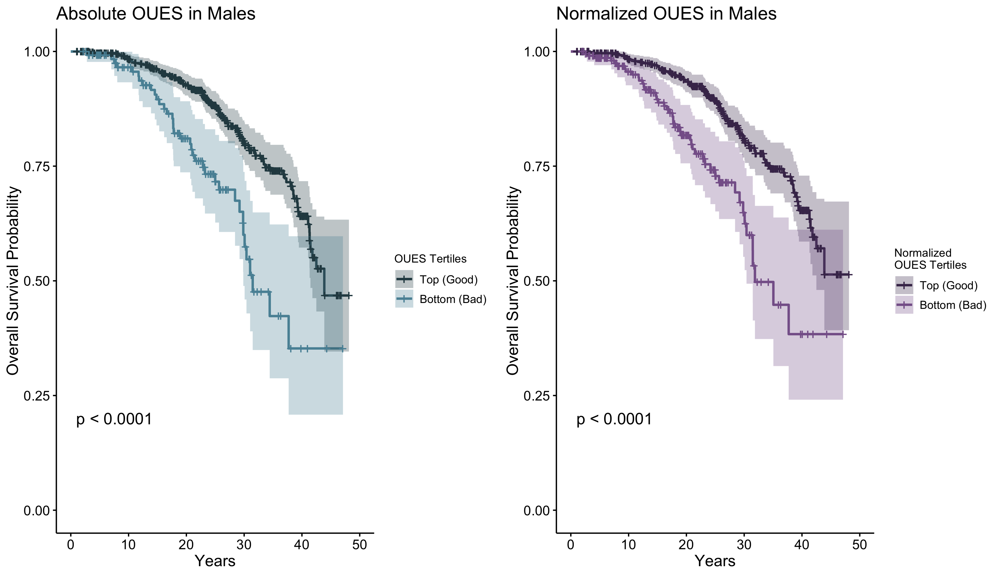

# Oxygen Uptake Efficiency Slope (OUES) as a Predictor of Mortality Risk

## Summary:
The oxygen uptake efficiency slope (OUES) is defined as the slope of the linear relationship between oxygen consumption (VO2) and the semilog transformed ventilation rate (VE) measured during an incremental exercise test. This study investigated the relationship between different measures of OUES and all-cause mortality in a cohort of apparently healthy adults. **OUES was found to be related to all-cause mortality in males but not females suggesting a determination of OUES has prognostic utility in males. Further, submaximal determinations of OUES could be valuable when a maximal exercise test is not feasible or desirable in males**.

## The Rationale:
The traditional variable of interest from cardiopulmonary exercise testing, and the most commonly used as an indicator of health is maximum or peak oxygen uptake (VO2peak). Other variables collected during CPX have received less attention but may also have prognostic utility for assessing health in both apparently healthy and clinical populations. One such variable is the oxygen uptake efficiency slope (OUES). 

The OUES is defined as the slope of the linear relationship between oxygen consumption (VO2) and the semilog transformed ventilation rate (VE) measured during an incremental exercise test. Some researchers normalize OUES to body surface area although this is not always the case. Additionally, because OUES is calculated from a linear relationship, it can be determined from a submaximal exercise test, highlighting its potential clinical value compared to variables measured from a maximal exercise test. 

Previous research has reported on the prognostic potential of OUES in clinical populations, yet no studies have examined OUES within a cohort of apparently healthy individuals. Moreover, research is needed on the prognostic potential of submaximal determinations of OUES as well as OUES normalized to body surface area. Thus, **the purpose of this study was to evaluate the relationship between OUES and all-cause mortality in a cohort of apparently healthy males and females**.

## The Process:
### Dataset creation.
The data for this study comes from the BALL ST cohort (a database from a longitudinal fitness program). 

To create the dataset for analysis, I first had to wrangle, clean, analyze, and combine two datasets:
1) Dataset consisting of health screening information, summary data from a cardiopulmonary exercise test, and mortality status/cause.
2) Dataset consisting of data from each minute of a cardiopulmonary exercise test. This dataset is in a "wide" format and is not available for every participant. This dataset was used to calculate the submaximal OUES values for each individual. Submaximal determinations of OUES were calculated using minute data from the initial 50% (OUES50) and 75% (OUES75) of total test time.

Wrangling and cleaning of the datasets relied heavily on the R package dplyr. Data were filtered to exclude extraneous values and to meet the inclusion criteria of the study (e.g., exercise test performed on a treadmill, aged 18-85 years old, at least 1 year of follow-up since the exercise test). Variables were also added to the dataset — body surface area was calculated from height and weight using an established [formula](https://pubmed.ncbi.nlm.nih.gov/650346/) and OUES tertiles were calculated for the Kaplan-Meier analyses. 

### Analysis.
The analysis examines the ability of OUES measures to predict all-cause mortality using Cox proportional hazard models. The predictive ability of the OUES models were then compared to traditional VO2peak models. Additionally, the script used for analysis outputs findings (and adds symbols for statistical significance) into tables that are saved as a .xlsx file to facilitate table preparation in manuscripts (i.e., allows for copy/pasting results into a Word file). 

The following models were created for each of the variables (OUES, normalized OUES, OUES50, OUES75) across the whole cohort as well as within males and females:
1) Univariate (just the variable of interest)
2) Multivariate (controlling for age, sex, and test date)
3) Multivariate (controlling for age, sex, test date, and risk factors as binary variables (obesity, hypertension, dyslipidemia, diabetes, inactivity, smoking status))
4) Multivariate (controlling for age, sex, test date, risk factors as binary variables (obesity, hypertension, dyslipidemia, diabetes, inactivity, smoking status), and VO2peak))

Schoenfeld residuals were examined to assess the assumption of proportional hazards underlying the Cox models. The relationships between the Schoenfeld residuals and the model covariates were either not statistically significant (_P_>0.05), indicating the proportional hazards assumption was met, or the residuals were plotted and the fit line of the plots fell within the confidence interval bounds for a horizontal linear trend suggesting statistically significant violations were not problematic

Comparisons of predictive capability were made between OUES measures and the traditional variable of interest from a maximal cardiopulmonary exercise test (VO2peak) by statistically comparing concordance values.

Descriptive statistics were performed to summarize baseline characteristics of the participants. To test for differences between sexes and mortality status (survivor vs. deceased), independent samples t-tests and Chi-square tests were performed when appropriate. In cases when significant statistical results were found, the script added significance symbols within the summary tables to further facilitate the ease of copy/pasting results into publication-ready tables in Microsoft Word.

To create a visualization for this study, I created Kaplan-Meier Curves using the survminer package in R. The OUES and normalized OUES plots were combined into one figure and can be seen below.

Lastly, I created Cox models using OUES tertile groups rather than the continuous OUES values for each individual (OUES_category_analysis.R) and I explored using random survival forest models rather than the Cox models to predict mortality (rand_surv_forest.R). The research group ultimately decided not to include these analyses in the manuscript — statistical models that were consistent with previous publications was preferred to allow for easier comparisons with previous work.

## The Final Product/Results:
Three scripts for R were used to create the dataset from the BALL ST cohort and then analyze/visualize the data (dataset_creation.R, data_analysis.R, and Kaplan_meier_curves.R). Prediction models using OUES, normalized OUES, and OUES75 measured from a maximal test were related to mortality in males independent of traditional risk factors. Submaximal determinations of OUES varied in their ability to assess risk with OUES determinations using maximal data generally having a greater ability to identify risk. The predictive capability of all the OUES measures was poor in females indicating that the predictive contribution from the model covariates outweighed those from OUES.

The Kaplan-Meier curves below illustrate the findings from the absolute and normalized OUES in the male-specific analyses ¬— those with a higher OUES had a greater probability of survival. 

Comparing the concordance index values from the models indicated the fully-adjusted OUES models did not statistically differ compared to the fully-adjusted VO2peak models. OUES measures also did not complement VO2peak models. 
Results from the full random survival forest model are illustrated below. Absolute OUES is important for predicting mortality, although the importance is below the traditional variable of interest from cardiopulmonary exercise testing, VO2peak.

Overall, these findings suggest assessments of OUES may have prognostic utility within apparently healthy males and submaximal determinations of OUES could be valuable when accurate assessment of VO2peak is not feasible. I summarized these findings and submitted the manuscript to the Journal of Cardiopulmonary Rehabilitation and Prevention where it was accepted for publication following peer review by experts in the field (link to be added upon official publication).
